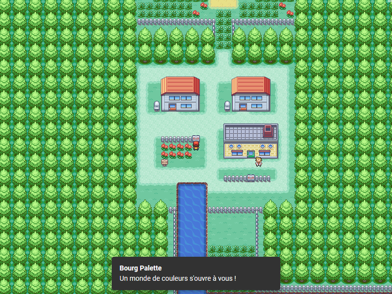

# Pokevue

> An attempt to recreate Pokemon Fire Red in the browser.
> Made with Vue.js and Phaser.
> https://pokevue-v2.surge.sh/

[](https://pokevue-v2.surge.sh/)

## Table of Contents

- [Key bindings](#key-bindings)
- [Project setup](#build-setup)
- [Credits](#credits)
- [Resources](#resources)
- [Something Missing?](#something-missing)

## Key bindings

```
ESC - Show/hide the menu
Espace - Interact with NPCs
V - Toggle camera view
```

## Project setup
```
npm install
```

### Compiles and hot-reloads for development
```
npm run serve
```

### Compiles and minifies for production
```
npm run build
```

### Run your tests
```
npm run test
```

### Lints and fixes files
```
npm run lint
```

### Customize configuration
See [Configuration Reference](https://cli.vuejs.org/config/).

## Credits

- [@mmorainville](https://github.com/mmorainville): game setup, movement system, collisions, NPC dialogues, GUI
- [@padeville](https://github.com/padeville): GUI implementation
- [@aymericingargiola](https://github.com/aymericingargiola) : battle system and UI, GUI

All assets are property of Nintendo.

## Resources
- [Creating a game-size world map of Pokémon Fire Red](https://medium.com/@mmmulani/creating-a-game-size-world-map-of-pok%C3%A9mon-fire-red-614da729476a)
- [How to Create a Turn-Based RPG in Phaser 3 – Part 1](https://gamedevacademy.org/how-to-create-a-turn-based-rpg-game-in-phaser-3-part-1/)
- [Modular Game Worlds in Phaser 3 (Tilemaps #1) — Static Maps](https://medium.com/@michaelwesthadley/modular-game-worlds-in-phaser-3-tilemaps-1-958fc7e6bbd6)

## Something Missing?

If you have a feature request or found a bug, [let me know](https://github.com/mmorainville/pokevue/issues).
